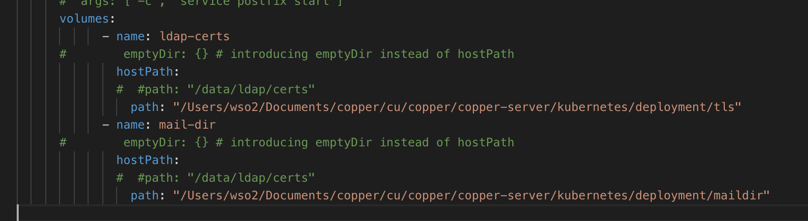
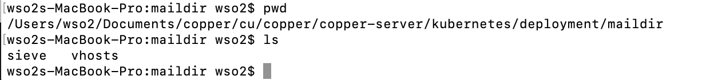
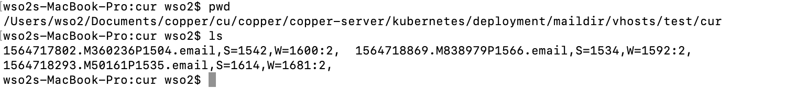
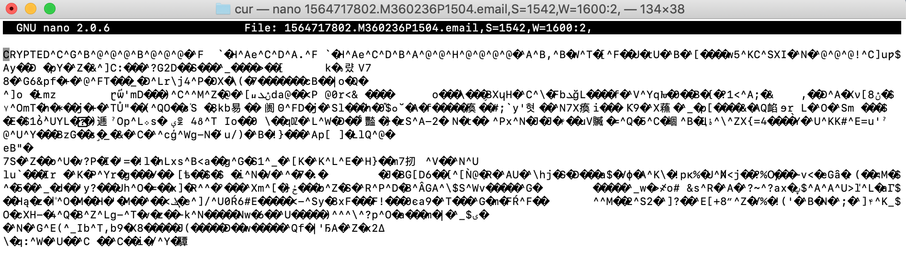

# Backups and Restoration


<p align="justify">
Backups and restoration is requied to ensure bussiness continuty in any corporate environment. Copper Email solution is bit complex so it has varity of data sources to be backed up. 
Still this backup and restoration part is not completed, this is the initila plan and hope to complete backup with suitable backup management system with encription .

Even though backing up is automated there should be a possibility to manually run the backup process too. Further restoraion is also should be done using latest backups from a shell coammand.

</p>

Copper system has 4 main data to make sure system is successfully backed up.

1. secret.yaml 
2. tls folder which has key files
3. data folder which has email maildir 


Pod(s) recovery when termination
What data should be backed up on below pods

*    Email
    Mail directory is created inside the email pod and email container. So there should be a method to backup this directory for an immediate solution. This mail dir backup option is must.

*    LDAP
    Ldap directory can be exported as an “ldif” file or there is a directory to save ldap data. It is required to backup one of them. LDAP backup option can be done manually too due to use base is not regularly updating. But there must be a backup option.

*    Group-office
    This is a web application. The only way to make it redundant is taking a snapshot of the container. This is optional due to this can be reconfigure with little effort.


*    Mysql
    Mysql database is configured on persistent volumes. PV and PVC ramin until pods are deleted. But mysql database holds data of groupoffice. So if groupoffice pod is lost or terminated then database also has to rebuild.


## hostPath
<p align="justify">


For bare metal implementations it is possible to use Hostpath.
A hostPathvolume mounts a file or directory from the host node’s file system into your Pod. This is not something that most Pods will need, but it offers a powerful escape hatch for some applications.
For example, some uses for a hostPathare:
running a Container that needs access to Docker internals; use a hostPathof /var/lib/docker
running cAdvisor in a Container; use a hostPathof /sys
allowing a Pod to specify whether a given hostPathshould exist prior to the Pod running, whether it should be created, and what it should exist as
In addition to the required path property, user can optionally specify a type for a hostPathvolume.


**** For copper solution we can use above solution according to whether it is bare metal implementation or GCE implementation.  So even though containers restarted there is no issue due to newly initiated containers will share same data. We had used hostpath solution in copper mail solution and temporarily removed due to users may find errors if they had not created the host path directory before the installation process.


</p>

### Sample host path configuration.


#### Volume configuration.

Volume mount in container path


This is a path in your localhost





Check local directory configured in your volumes.





Check the Encripted mails inside mail directory.





Check the content of the mail whether it is encripted.





So we can see that mail is encripted and it is possible to backup these mails somewhere else repository.

For this perpose we can use many kubernetes cloud storage solutions like. 

    awsElasticBlockStore
    azureDisk
    azureFile
    cephfs
    cinder
    glusterfs
    hostPath
    iscsi
    local
    nfs
    persistentVolumeClaim
    projected
    portworxVolume
    quobyte
    rbd
    scaleIO
    secret
    storageos

One risk of keeping all your data on local machines is that in case of a natural disaster, fire or flood, your local system will be damaged and you will lose your data. It's recommended to keep another copy of your data on a machine located elsewhere.
Then we can sync mail directories using rsync command over network.

#### Backup Files in your local directory With Rsync

This is where ssh protocol comes into play. I use the following syntax to sync a remote directory with a local directory:

    rsync -avzP --delete -e ssh user@server_IP:source-directory /destination_directory_on_local_machine/

Example :

```
rsync -avzP --delete -e ssh 
 This e-mail address is being protected from spambots. You need JavaScript enabled to view it
 :/home/swapnil/backup/ /media/internal/local_backup/
```

To sync a local directory with a remote directory the syntax becomes:

    rsync -avzP --delete -e ssh source_directory user@server_IP:path_destination_directory

Example :

```
rsync -avzP --delete -e ssh /home/swapnil/Downloads/ 
 user@server_IP:/home/swapnil/Downloads/
```

### Now time to automate the backup
Now run 'crontab -e' to create cron jobs. It will open an empty file where you can configure the command that you want to run at a desired time. (See image, above.)

The format of crontab is simple; it has five fields followed by the command:

    m h dm m dw command

Here m stands for minutes (0-59); h for hour (0-23); dm for day of the month (1-31); m for month (1-12); and dw for day of the week (0-6 where 0 is Sunday). The format is numerical and you have to use ‘*’ to commend the fields that you don’t want to use.

I run the command every day at 11.30 so the format will be

    30 23 * * * rsync -av --delete /media/hdd1/data-1/ /media/hdd2/data-2/


## Volume configuration in GKE

### gcePersistentDisk
<p align="justify">

A gcePersistentDiskvolume mounts a Google Compute Engine (GCE) Persistent Disk into your Pod. Unlike emptyDir, which is erased when a Pod is removed, the contents of a PD are preserved and the volume is merely unmounted. This means that a PD can be pre-populated with data, and that data can be “handed off” between Pods.
Caution:You must create a PD using gcloudor the GCE API or UI before you can use it.
	So email server Mail Dir will work with this solution. But the limitation is this is a GCD solution. But same optional services to be implemented for other cloud operators.


</p>