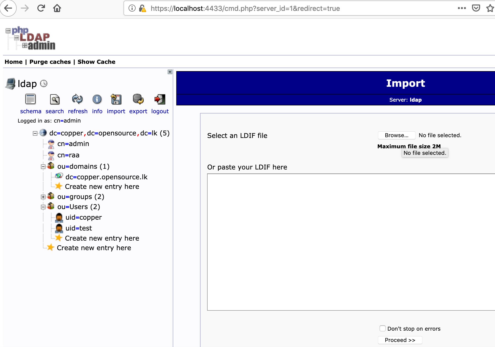
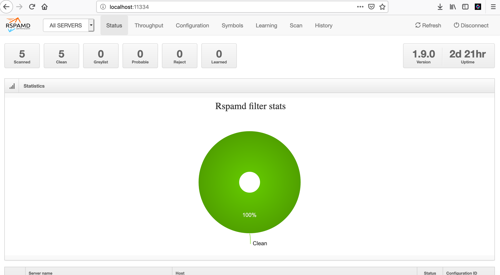
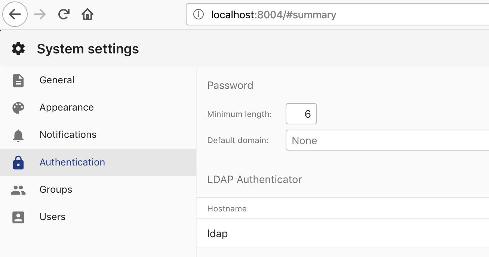
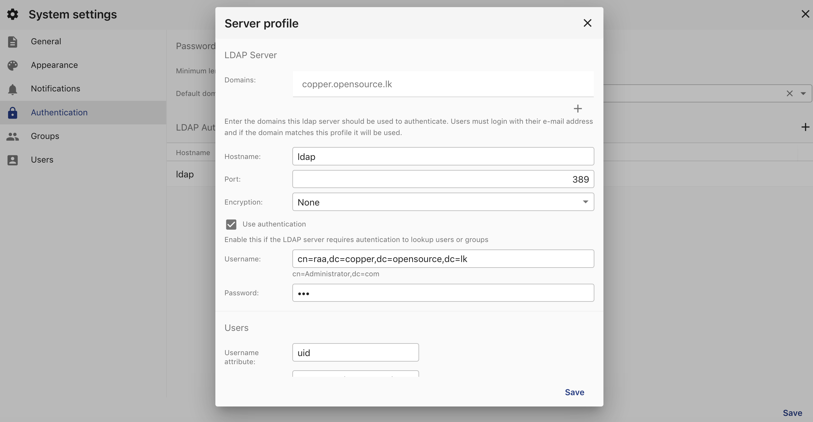
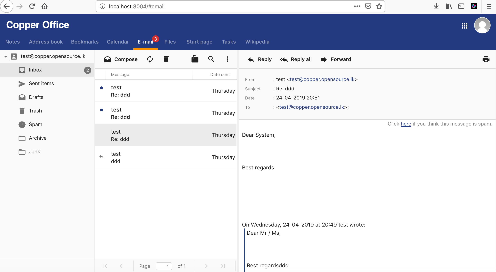
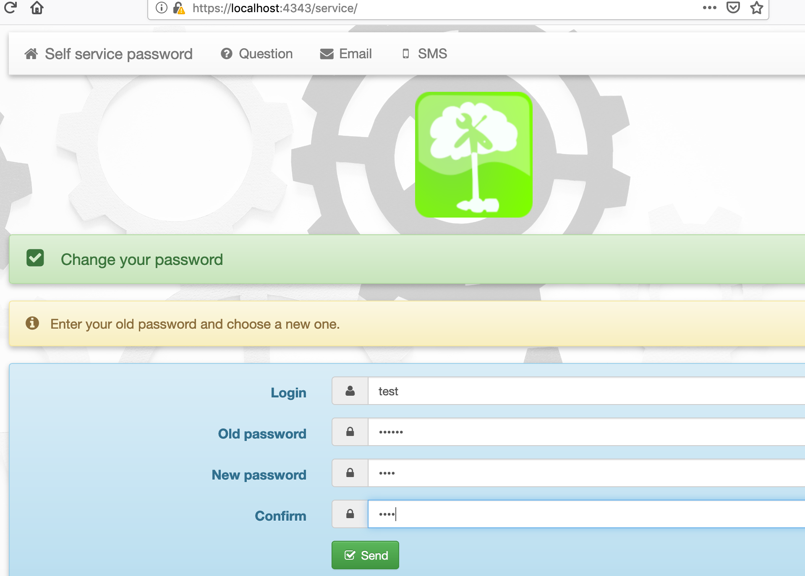
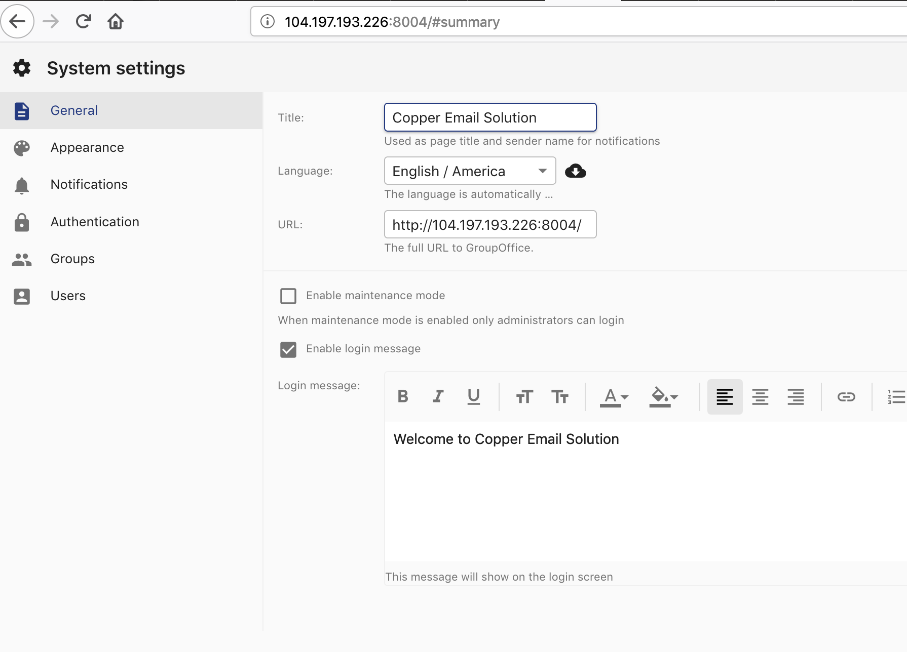
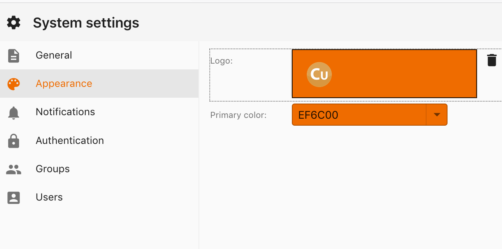
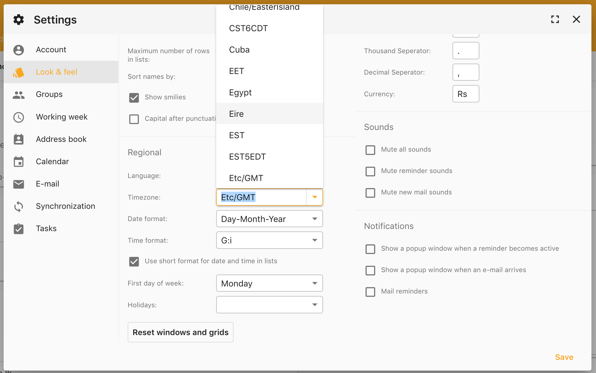

# Initial Configuration

After successfully installation suing shell file then Basic configurations requied to make sure that the systme is up and running inorder. First you have to check userbase using phpldapadmin interface and then configure groupoffice to access your email server. thats it.

## Testing phpldapadmin user management

    URL :https://localhost:4433
    // Hear the read only usr name and pasword should be provided for cn.
    Ex : username : cn=readonly,dc=copper,dc=opensource,dc=lk
    password : readonlypassword

   

    - Once successully loged in then you have to import some test users creation file  (ldap.ldif).

Importing ldap.ldif created while installation from phpldapadmin.

## Testing RSPAMD

    RSPAMD is the spam filtering service in this email solution.

    URL :http://localhost:11334/

    - Password : <password provided at installation step>

    

## Configure groupoffice

URL :http://localhost:8004

You will see the installation page of the groupoffice package.
First create the admin user and start installation.

Then login from the admin user name and start the configuration.

Groupoffice is a userfriendly groupware and it has all coloborative tools which are requied for any organization in the world now. Next groupoffice groupware should be configured to work with email server.
It is must to follow bellow steps to make sure you have successfuly connected with the emailserver and openldap server.

### Adding LDAP Authenticaiton module to the GroupOffice

1. Login as admin

2. Then go to Admin menu - > Modules  and add checked on community -> LDAP Authenticator

3. Then go to System setting and Authentication . If it has not LDAP section then refresh the page.

4. Clikc on "+" mark to add ldap connection provide following parameters.

5. Then refresh the page and go to System setting -- > Authentication tab

Interface of Authentication tab.

 

### Configure LDAP Server

    Domains : Domain name configured for ldap server

    Hostname : LDAP server host name

    Protocol : LDAP protocol

    ENCRIPTION : TLS

    Checked on Use Authentication

    Provide Username and password for ldap readonly user.

    Ex : usrname : cn=raa,dc=copper,dc=test,dc=lk

    Ex : password : XXXX

    Userbase details of LDAP server

    username attribute  : uid

    peopleDN : Ex : ou=Users,dc=copper,dc=test,dc=lk

    groupDN : Ex : ou=groups,dc=copper,dc=test,dc=lk

Check on create email server for users

These all configurations are in same interface.

### IMAP server configuration

    IMAP Host : email

    Port      : 143

    Encription: TLS

    Ubcheck validate certificate

### SMTP server configuration

    HOST      : email

    Port      : 587

    Check on use user credentials.

    Encription : TLS

    Uncheck validate certificate

### Users adding to a group

Finaly add the user to the Internal group

Now groupoffice configuration is complete. Then you can can log using your email account to group office for your domain. 

GroupOffice mail client.

## Password change for users.

By default test users password is set to "coppermail@lsf" or when system admin set a password for specific users it will be known to administrator. So once a new user log in to the system after admin
provided the credential user has to change the password. There is a seperate interface for this perpose.
use provide the usernmae , current password, new password and confirme new password.

https://localhost:4343/service/

use provide the usernmae , current password, new password and confirme new password.

 

Thats it . Usre's account is users now.

        
## Update Organization Profile.

Update profile (Include organization name, time zone, language) are possible for administrators. It is possible to change the Title name, language and provide a welcome message at login. Configurations are avilable in the System settings.

### Change the theme color and Organization logo

From Appearance tab in the system settings it is possible to change the theme color and the company logo.

### Change the time zone

For changing the time zone User has to go My Account - > Look & Feel.

