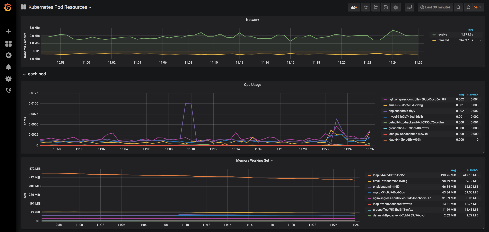
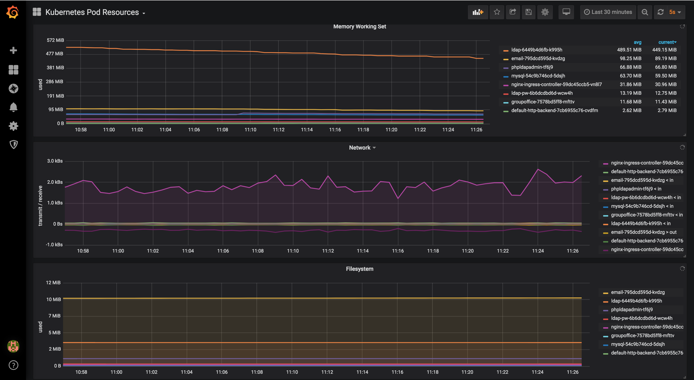
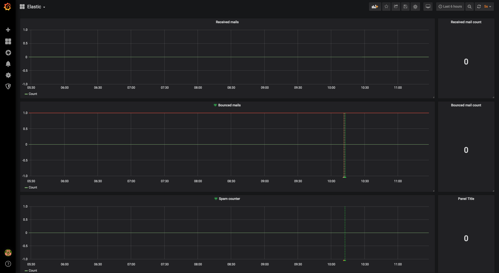
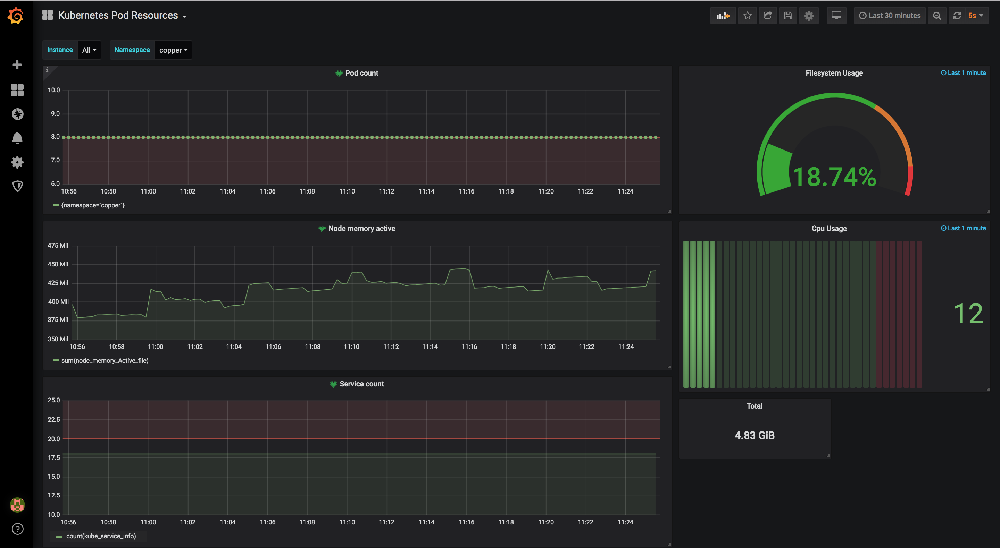
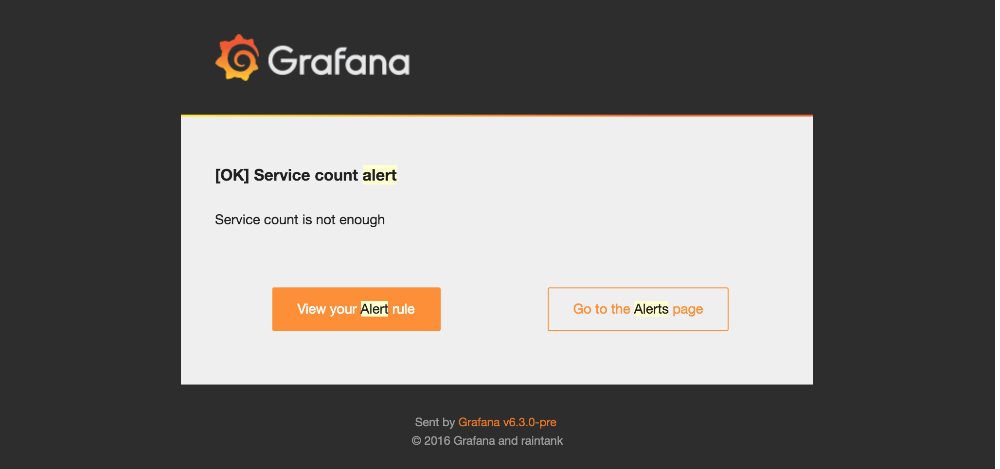
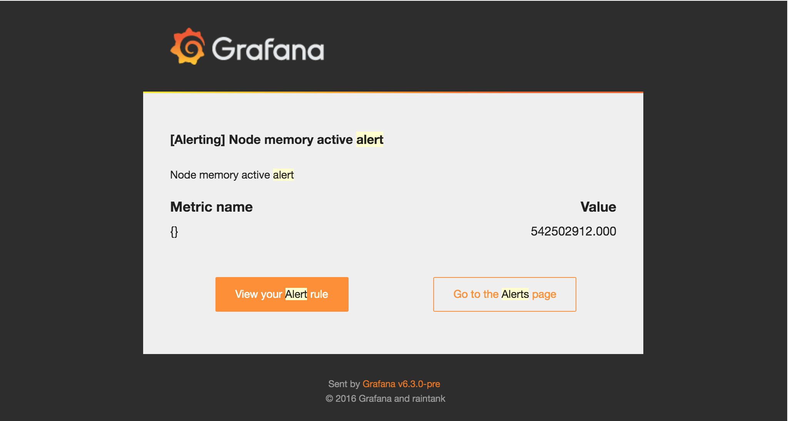
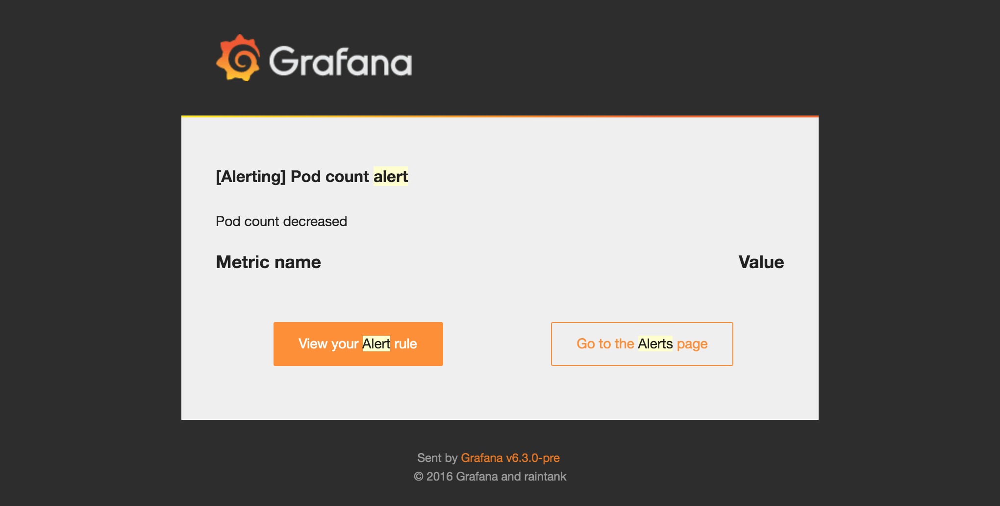
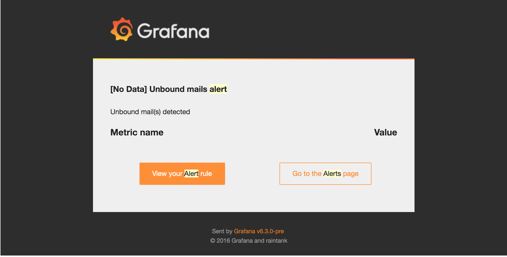

## Copper Hub features

Copper Centralized hub has dashbord and alert features. So far it has configured with most basic Alerts and statics. But it concept with generic tools like promotheus and other stack can be developed as more customized solution. 

Hear some basic dashboards and alerts are shown.

### Dash Boards

#### Pod Resources

#### Network

#### Mail log data

#### Additional Stats

### Alerts

All alerts can be configured as emails.
Following alerts configured for testing perposes.

#### Service Count

#### Node Memory

#### Pod count

#### Mail Alerts

