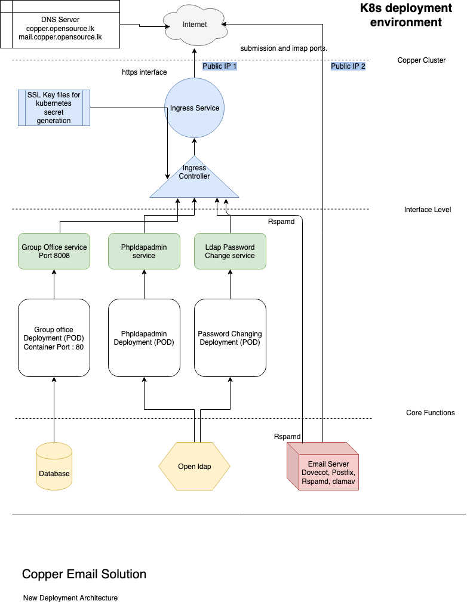

# Installation Process

## Installation
<p align="justify">
This file describe the installation process in detailed for email version 0.7 and higher. Basically this deployment architecture is consists with kubernetes container orchestration facilites as shown in bellow figure. It consists with some kubernetes services like
secrets, ingress and deployments and services etc. So all interfaces can be accessed through a loadbalancer which works as a reverse proxy and all interfaces are https enabled with ingress deployment. But This version need some more configurations. If you want a quick look just go for version 0.6 which has least amount of configurations.

</p>




## Clone this Repository

```
$ git clone https://github.com/LSFLK/Copper.git
```
## Create the volume for the emailserver 

It is required to create a hostpath volume as mentioned in the k8s yml files at the end of each file in "hostPath" tag.

```
      volumes:
            - name: ldap-certs
              hostPath:
                path: "/Users/wso2/Documents/copper/copper/copper-server/kubernetes/tls"
                

```

So "/Users/wso2/Documents/copper/copper/copper-server/kubernetes/tls" shoul have created 
in the server or it is must to change according to your preffered path in k8s yml files.


## Generate certificate files.
<p align="justify">
This shell file will create necessary self signed certifcate for the system and then those certificates are used to create kubernetes tls secrets. 
</p>

```
$ sh certification.sh 

```


## Host name change for local installation
<p align="justify">
In localhost deployment for testing perposes it is must to add line for localhost for testing perposes.

</p>

```
$ nano /etc/hosts

add following line

127.0.0.1   <you domain name>

Ex : 127.0.0.1  copper.opensource.lk

```

## Start the copper-server deployment
```
$ cd Copper/copper-server/kubernetes/deployment/
$ sh deploy.sh
```

## You may have to provide following informaiton while the installation process is going on.


    Enter mysql database name:

    Ex : copper

    Enter mysql database password:

    Ex : copper

    Your domain must contain 3 parts. (Eg: part1.part2.part3)
    Enter the first part of domain:

    Ex : copper

    Enter the second part of domain:

    Ex : test

    Enter the third part of domain:

    Ex : lk

    Enter LDAP admin password:

    Ex : admin

    Enter LDAP readonly user name:

    Ex : raa

    Enter LDAP readonly user password:

    Ex : raa

    Enter organization name

    Ex : lsf

    Enter password for spam filter (RspamD)

    Ex : spam

Ex : Image of running deply.sh


## Check kubernetes pods.

<p align="justify">

Then system installation process will begin. It will not take much time to install the system. But it is must to check kubernetes pods whether to know system is installed successfully. All pods status must be "Running".
</p>

```
$kubectl get pods -n copper
```


## Check kubernetes secrets

```
kubectl get secrets -n copper
```
Following sercrets should have been created.


```
email-secret          Opaque                                57     1h
tls-certificate       kubernetes.io/tls                     2      1h
tls-dhparam           Opaque                                1      1h

```


## Check kubernetes services.

<p align="justify">

Further kubernetes services also should be checked. All LoadBalancers External IP should be "localhost" and all nodeport's External IP should be  "<none>". PORTs can be seen from bellow command and 
</p>

```
$kubectl get services -n copper
```


 


 ## Check kubernetes services.

<p align="justify">
If services are ok, check using browser whether you can access these interfaces. "copper.opensource.lk" is the domain name you configured in the host file.
</p>

Groupoffice

    https://copper.opensource.lk/

phpldapadmin
    
    https://copper.opensource.lk/phpldapadmin/

user password change

    https://copper.opensource.lk/service/


If you find any issue accessing above urls then just try recreating ingress loadbalancer.

```
# Delete existing ingress

kubectl delete service nginx-ingress -n copper

kubectl delete deployment nginx-ingress-controller -n copper

# Exicute following command from kubernetes folder to recreate ingress 

kubectl create -f Ingress/nginx-controller.yaml

```


<p align="justify">
Some time it is required to uninstall the system. For that there is a shell script uninstall.sh 
</p>

    $ sh undeploy.sh

Ex : Image of running undeploy.sh


